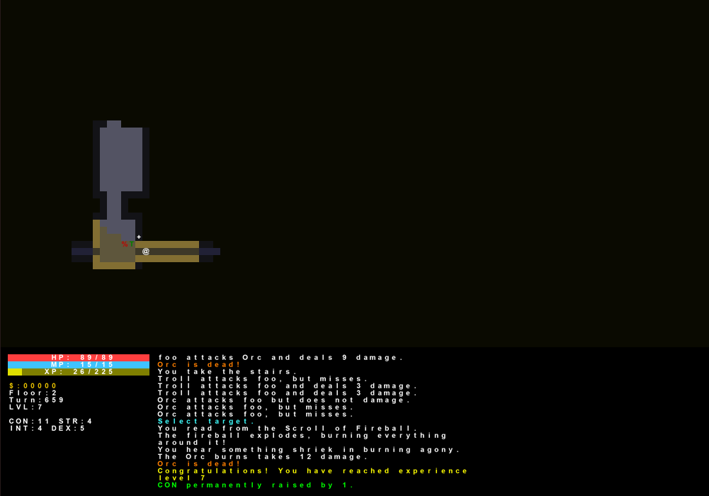

A basic implementation of a roguelike dungeon crawler

# Requirements:
- Python3.6+
- pip

# Installation 
`pip install -r requirements.txt`

# Basic Controls
- Movement:
  - Arrow keys
  - Num-pad (also includes diagonal movement)
- Quitting: `Esc`
- Looting: `,` or `L` 
- Checking inventory: `i`
- Equipment: `e`
- Unequip: `u`
- Take stairs: `Enter`
- Wait: `z` or `.`
- Attack: Movement keys when 1 tile away from enemy